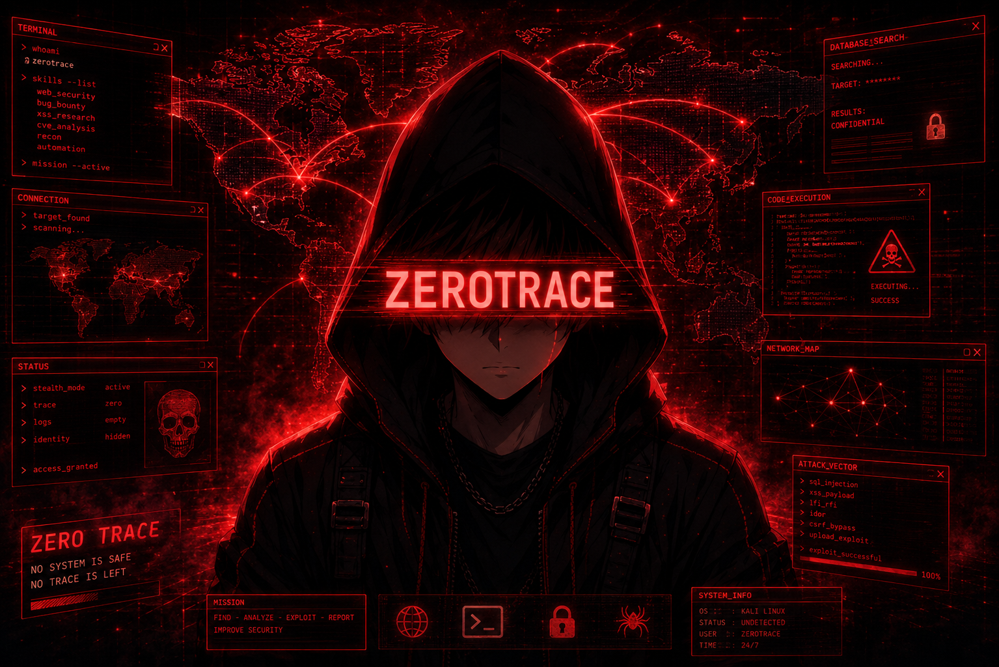

<div align="center">


<a href="https://github.com/zero-trace7">
  
</a>


<br/>


<br/>


<br/><br/>


</div>

---

<div align="center">

```text
 ┌─────────────────────────────────────────────────────────────┐
 │                                                             │
 │   ┌──(zerotrace㉿kali)-[~/research]                          │
 │   └─$ cat identity.txt                                      │
 │                                                             │
 │     alias    : Zero Trace                                   │
 │     handle   : @zero-trace7                                 │
 │     role     : Cybersecurity Researcher                     │
 │     craft    : Bug Bounty · XSS Research · Web Security     │
 │     contact  : X → @Zero_Dayy7                             │
 │     motto    : "I don't find bugs. I find what was never    │
 │                meant to be found."                          │
 │                                                             │
 │   ┌──(zerotrace㉿kali)-[~/research]                          │
 │   └─$ █                                                     │
 │                                                             │
 └─────────────────────────────────────────────────────────────┘
```

</div>

---

## <samp>// About Me</samp>


<br/>

```text
  ┌──────────────────────────────────────────────────────────┐
  │                                                          │
  │   🔍  XSS Research      →  Reflected · Stored · DOM     │
  │   🐛  Bug Bounty        →  Active on major platforms     │
  │   🌐  Recon             →  Subdomain · JS · Endpoints    │
  │   🐍  Automation        →  Custom Python tooling         │
  │   🕷️  Web Pentesting    →  Auth bypass · Logic flaws     │
  │   📜  Disclosure        →  Responsible reporting         │
  │                                                          │
  └──────────────────────────────────────────────────────────┘
```

<p align="left"><sub><i>" The most dangerous vulnerability is the one no one thought to look for. "</i></sub></p>

<br clear="right"/>

---

## <samp>// Arsenal</samp>

<div align="center">


<br/><br/>


</div>

---

## <samp>// Projects</samp>

<div align="center">

<a href="https://github.com/zero-trace7">
  
</a>
<a href="https://github.com/zero-trace7">
  
</a>
<a href="https://github.com/zero-trace7">
  
</a>
<a href="https://github.com/zero-trace7">
  
</a>

<br/><br/>

<sub><i>Click any badge above to view the full repository and source code.</i></sub>

</div>

---

## <samp>// Stats</samp>

<div align="center">


<br/><br/>


</div>

---

## <samp>// Connect</samp>

<div align="center">

<a href="https://github.com/zero-trace7">
  
</a>
<a href="https://x.com/Zero_Dayy7">
  
</a>

</div>

---

<div align="center">

### <samp>// Disclosure Notice</samp>

```diff
! All security research is performed ethically within controlled lab environments.
+ Vulnerabilities are disclosed responsibly to affected vendors before any publication.
- Unauthorized use of any code or technique from this profile is strictly prohibited.
```

<br/>


<sub><i>" The most dangerous vulnerability is the one no one thought to look for. "</i></sub>

</div>
